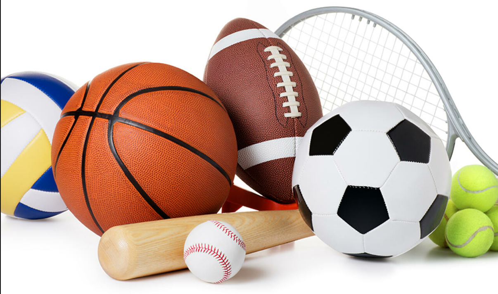

  
```{css, echo = FALSE}
.columns {display:flex;}
h1.title {font-size: 40 px;color: #0000CD}
    h1 {color:#1874CD; font-size: 30px ;font-family: Arial Black}
        h2{color: #1874CD; font-size: 20px; font-family: Arial}
            
            body { background-color: #98F5FF}
                a {color: #010101;}
                    .list-group-item.active, .list-group-item.active:focus, .list-group-item.active:hover {
                      z-index: 2;
                      color: ;
                      background-color: #c4342d;
                        border-color: palered;
                    }
                  .nav-pills > li.active > a, .nav-pills > li.active > a:hover, .nav-pills > li.active > 
```

```{r chunk-setup, include = FALSE}
                  knitr::opts_chunk$set(echo = TRUE, eval = TRUE, message = FALSE, warning = FALSE, 
                                        #results = "hold",
                                        cache = FALSE, cache.path = "/caches/", comment = "#>",
                                        #fig.width = 7, #fig.height= 7,   
                                        #out.width = 7, out.height = 7,
                                        collapse = TRUE,  fig.show = "hold",
                                        fig.asp = 0.628, out.width = "75%", fig.align = "center")
```

```{r options-setup, include = FALSE}
                  options(scipen = 999) #- para quitar la notación científica
                  options("yaml.eval.expr" = TRUE)
```
                  
```{r klippy, echo = FALSE}
                  klippy::klippy(position = c("top", "right")) #- remotes::install_github("rlesur/klippy")
```
                  
                  
                  
<hr class="linea-black">
      
                                


Trabajo elaborado para la asignatura "Programación y manejo de datos en la era del Big Data" de la Universitat de València durante el curso 2021-2022. El repo del trabajo está [aquí](https://github.com/meneuf/trabajo_BigData){target="_blank"}. 
                  
                  
La página web de la asignatura y los trabajos de mis compañeros pueden verse [aquí](https://perezp44.github.io/intro-ds-21-22-web/07-trabajos.html){target="_blank"}.
                  
         
                    


                   
# 1. INTRODUCCIÓN
                    
En el presente trabajo voy a mostrar algunos datos de interés sobre el deporte. El deporte esta muy presente en nuestras vidas, tanto para la gente que lo práctica como para la gente que lo disfruta viendolo. Mi objetivo en este trabajo es que podaís informaros estadísticamente como de presente esta el deporte en nuestro país.
                  

                  

# 2. CARGAMOS DATOS Y PAQUETES

```{r, eval = TRUE}         
library(ggplot2)
library(dplyr)
library(ggthemes)
library(hrbrthemes)
library(gganimate)
library(wordcloud2)
library(viridis)
library("plotly")
library(geometries)
library(labeling)
library(mapdata)
library(scales)
library(gt)
library(tibble)


GastoHogares<- rio::import("./datos/GastoHogares.csv")
HabitosDeportivos <- rio::import("./datos/HabitosDeportivos.csv")
NivelEstudios <- rio::import("./datos/NivelEstudios.csv")
GastoPublico <- rio::import("./datos/GastoPublico.csv")
Empresas <- rio::import("./datos/Empresas.csv")
Record <- rio::import("./datos/Record.csv")
Campeonatos <- rio::import("./datos/campeonatos.csv")
```


# 3. HÁBITOS DEPORTIVOS

Todos sabemos que el sedentarismo es uno de los principales enemigos de la salud. Nuestro cuerpo ha sido diseñado para estar en movimiento, y los músculos requieren de activación física para mantenerse fuertes. De hecho, muchas enfermedades se pueden prevenir llevando una rutina deportiva adecuada. Por ello tener hábitos deportivos es esencial. 

```{r}
df_habitos <- HabitosDeportivos %>%
 filter(!(Tramo_Edad %in% "15-..."))

p1 <- ggplot(df_habitos) +
 aes(x = Tramo_Edad, fill = Tramo_Edad, weight = Porcentaje) +
 geom_bar() +
 scale_colour_viridis_c(option="magma") +
 theme_minimal() +
 facet_wrap(vars(Periodo)) + theme(plot.subtitle = element_text(size = 11),
    axis.title = element_text(size = 10),
    plot.title = element_text(size = 12)) + labs(title = "Porcentaje de la población con habitos deportivos",
    x = "Tramo de Edad", y = "Porcentaje de la población") + theme(panel.grid.major = element_line(colour = "#98F5FF"),
    panel.grid.minor = element_line(colour = "#98F5FF"),
    panel.background = element_rect(fill = "#98F5FF"),
    plot.background = element_rect(fill = "#98F5FF"),
    legend.background = element_rect(fill = "#98F5FF"))

ggplotly(p1)

```
En este gráfico se puede ilustrar como los hábitos deportivos han aumentado de 2010 a 2020, en todos los rangos de edades, algo sin lugar a dudas beneficioso.


# 4. EMPRESAS RELACIONADAS CON EL DEPORTE 
```{r}
df_empresas <- Empresas %>% 
  select(CCAA, Empresas) %>%
  group_by(CCAA) 

bb <- ggplot(df_empresas, aes(x="", y= Empresas, fill = CCAA))+
  geom_bar(width = 1, stat = "identity") +
  labs(title = "Cantidad de empresas vinculadas al deporte en cada CCAA",
       x = " ",
       y = " ", fill= "") +  guides(fill=guide_legend(ncol=2)) + theme(panel.grid.major = element_line(colour = "#98F5FF"),
    panel.grid.minor = element_line(colour = "#98F5FF"),
    panel.background = element_rect(fill = "#98F5FF"),
    plot.background = element_rect(fill = "#98F5FF"),
    legend.background = element_rect(fill = "#98F5FF")) +labs(fill = NULL) 

cc <- bb + coord_polar("y", start=0)
cc + theme_minimal()

```
En este gráfico podemos observar la cantidad de empresas relacionadas con el deporte que tiene cada Comunidad Autónoma, destacan sobretodo Andalucia, Cataluña y Madrid.


# 5. GASTO TOTAL HOGARES
Este apartado nos servirá para tener una idea lo implicadas que están las familias en el deporte.
```{r}
df_hogares <- GastoHogares %>%
  select(Años, Gasto.total)


ggplot( data= df_hogares, aes(x=Años, y= Gasto.total, colour = Gasto.total)) +
  geom_line() +
  geom_point() +
  ggtitle("Evolución del gasto de los hogares en deportes") +
  theme_ipsum() +
  ylab("") + scale_x_continuous(  
    breaks = c(2010.0, 2015.0, 2020.0),
     label = c("2010", "2015", "2020")) +
  transition_reveal(Años) + theme(panel.grid.major = element_line(colour = "#98F5FF"),
    panel.grid.minor = element_line(colour = "#98F5FF"),
    panel.background = element_rect(fill = "#98F5FF"),
    plot.background = element_rect(fill = "#98F5FF"),
    legend.background = element_rect(fill = "#98F5FF")) +labs(fill = NULL)
  
```

# 6. GASTO PÚBLICO 
El gasto público dedicado al deporte es esencial, a mayor gasto mas se incentivará a las personas a realizar deporte, más y de mayor calidad. 

```{r}
GastoPublico %>%
 tail(10) %>%
  ggplot( aes(x=Años, y=Gasto.Público.AdmLocal)) +
    geom_line( color="grey") +
    geom_point(shape=21, color="black", fill="#69b3a2", size=3) + ylab("Gasto") +
    theme_ipsum()  +  ylim(0,3100) + scale_x_continuous(  
    breaks = c(2010.0, 2015.0, 2012.5, 2017.5),
     label = c("2010", "2015", "2012", "2017")) +
    ggtitle("Evolución gasto público") + theme(panel.grid.major = element_line(colour = "#98F5FF"),
    panel.grid.minor = element_line(colour = "#98F5FF"),
    panel.background = element_rect(fill = "#98F5FF"),
    plot.background = element_rect(fill = "#98F5FF"),
    legend.background = element_rect(fill = "#98F5FF")) +labs(fill = NULL)

```


# 7. RÉCORDS EN ESPAÑA </FONT> {.tabset} 
España es un país que suele destacar en los deportes. Tenemos a miles de deportistas espectaculares que año a año nos traen medellas a casa. Aquí ilustraré los deportes en los que hemos conseguido más records. 


## <FONT COLOR="#030303">Total</FONT>
```{r}
df_recordtotal <- Record %>%
  select(Deportes, Total) %>%
  slice_max(Total, n = 5)%>%
  arrange(desc(Total))


df <- ggplot(df_recordtotal, aes(x=Deportes, y=Total)) +
  geom_segment( aes(x=Deportes, xend=Deportes, y=0, yend=Total)) +
  geom_point( size=5, color="purple", alpha=0.5, shape=40, stroke=1) + theme(axis.title.x=element_blank(),
        axis.text.x=element_blank(),
        axis.ticks.x=element_blank()) +  labs(title = "Top 5 récords",
              subtitle = "año 2020", 
              x = "Deportes",
              y = "Record")  + theme(panel.grid.major = element_line(colour = "#98F5FF"),
    panel.grid.minor = element_line(colour = "#98F5FF"),
    panel.background = element_rect(fill = "#98F5FF"),
    plot.background = element_rect(fill = "#98F5FF"),
    legend.background = element_rect(fill = "#98F5FF")) +labs(fill = NULL)

ggplotly(df)

```

## <FONT COLOR="#030303">Mujeres</FONT>

```{r}
df_recordmujeres <- Record %>%
  select(Deportes, Mujeres) %>%
  slice_max(Mujeres, n = 5)%>%
  arrange(desc(Mujeres))

wordcloud2(data=df_recordmujeres, size=0.4)
```

## <FONT COLOR="#030303">Hombres</FONT>
```{r}
df_recordhombres <- Record %>%
  select(Deportes, Hombres) %>%
  slice_max(Hombres, n = 5)%>%
  arrange(desc(Hombres))


ph <- ggplot(df_recordhombres, aes(x = Deportes, y = Hombres), color = "Hombres") +
geom_bar(fill = "#FF83FA", stat = "identity") +
xlab("") +
ylab("") +
ggtitle("Los 5 deportes con más records conseguidos por hombres") +
coord_flip() + theme_minimal() + theme(panel.grid.major = element_line(colour = "#98F5FF"),
    panel.grid.minor = element_line(colour = "#98F5FF"),
    panel.background = element_rect(fill = "#98F5FF"),
    plot.background = element_rect(fill = "#98F5FF"),
    legend.background = element_rect(fill = "#98F5FF")) +labs(fill = NULL)

ggplotly(ph)

```


# 8. CAMPEONATOS UNIVERSITARIOS
Las universidades españolas por términos general estan implicadas bastante en los deportes, dandoles todo tipo de facilidades a los estudiantes para que practiquen cualquier deporte a precios reducidos. Sin duda la calidad de estos universitarios es ejemplar puesto que miles de estudiantes participan cada año en elos campeonatos de españa universitarios tras esfuerzo y sacrificio. En esta tabla os voy a mostrar que deporte es el que cuenta con mayores participantes.
```{r, eval=TRUE}
df_campeonatos <- Campeonatos 

dftop1 <- df_campeonatos %>% slice_max(Value, n=1)

Imagen <- "https://upload.wikimedia.org/wikipedia/commons/c/cc/Provas_de_Atletismo_nas_Olimp%C3%ADadas_Rio_2016_%2828488087214%29.jpg"

dftop1 <- dftop1 %>% add_column(Imagen)

Tabla_dtop1 <- dftop1 %>% gt()

Tabla_dtop1 <- Tabla_dtop1 %>%
                   tab_header(title = md("**Deporte con mayor participación en los cto.**"))
                   
Tabla_dtop1 <- Tabla_dtop1 %>%
                tab_options(heading.background.color = "#0000FF") %>% tab_options(heading.title.font.size = 17,  column_labels.font.weight =  "bold")


Tabla_dtop1 <- Tabla_dtop1  %>%
  gt::text_transform(locations = cells_body(columns = c(Imagen)), fn = function(x) {gt::web_image(x, height = 30)}) %>%  cols_align(
   align = "center")

Tabla_dtop1

  

```


# BIBLIOGRAFIA 

- [enlace a la página web de la asignatura](https://perezp44.github.io/intro-ds-21-22-web/index.html)

- [enlace galeria de gráficos de ggplot2](https://www.r-graph-gallery.com/)

- [enlace a la página web de los datos económicos del trabajo](https://www.culturaydeporte.gob.es/dam/jcr:b24c68ad-75ff-48d0-aa1f-d57075f22e64/anuario-de-estadisticas-deportivas-2021.pdf)


